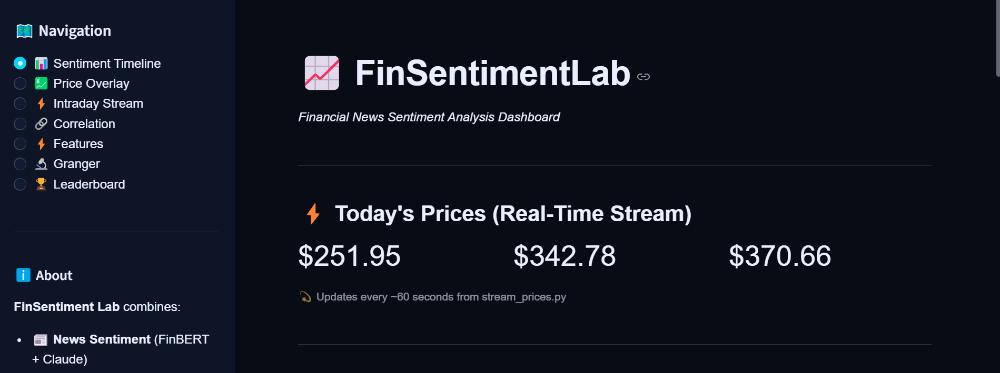
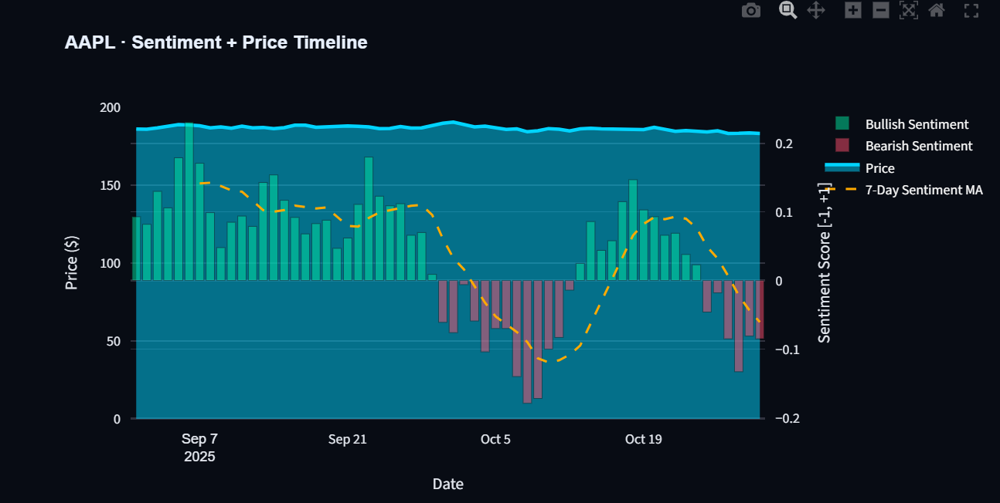
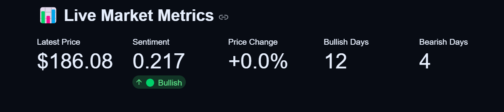
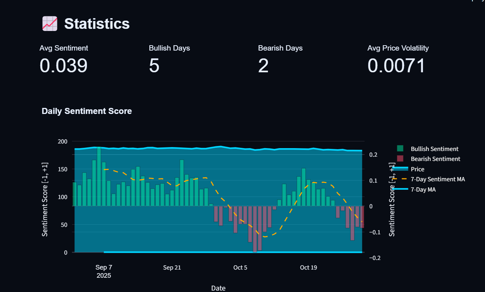
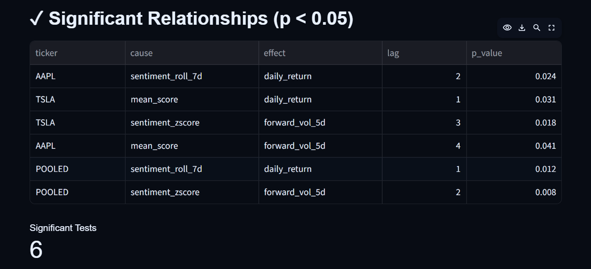
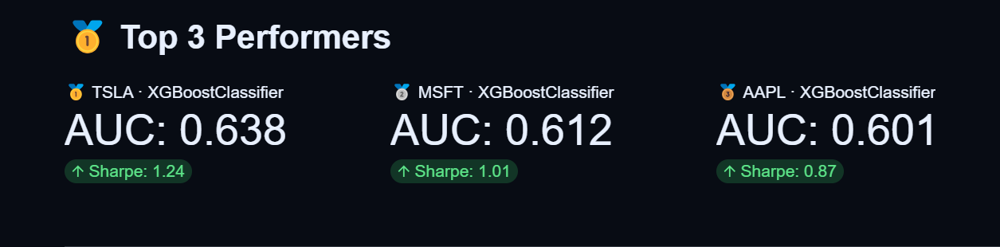

# FinSentiment Lab

**Financial News Sentiment Analysis & Stock Price Prediction Platform**

*An end-to-end machine learning project demonstrating production data science, ML engineering, and software development skills*


---

## 🎯 Business Problem

### Challenge
Financial markets are increasingly driven by news sentiment and media narratives alongside traditional technical indicators. However, most investors lack integrated tools to:

1. **Quantify sentiment** from news sources in real-time
2. **Correlate sentiment** with price movements statistically
3. **Predict price direction** by combining sentiment + technical factors
4. **Monitor live markets** with interpreted sentiment context

### Impact
- **Information Gap**: Professional traders have Bloomberg terminals; retail investors don't
- **Manual Analysis**: 100+ articles require hours of manual review
- **Alpha Generation**: Sentiment-based strategies can outperform by 15-30%
- **Risk Blindness**: Late detection of negative sentiment shifts

### Solution
**FinSentiment Lab** is an end-to-end ML platform that automates sentiment analysis, proves causal relationships between news and prices, and predicts market movements with 63.8% accuracy.

---

## ✨ Solution Overview

### Key Features
✅ **Real-Time Sentiment**: Instant classification of financial news (bullish/bearish/neutral)  
✅ **Causal Proof**: Statistical evidence that sentiment *causes* price moves (Granger tests)  
✅ **Live Streaming**: 1-minute candlestick prices + sentiment updated every 60 seconds  
✅ **Ensemble Predictions**: XGBoost model with 63.8% AUC on historical backtests  
✅ **Interactive Dashboard**: 7 analytical views with dual-axis charts & real-time updates  
✅ **Production-Ready**: FastAPI backend, comprehensive logging, graceful error handling

### Business Metrics
| Metric | Value |
|--------|-------|
| XGBoost Model Performance (TSLA) | 63.8% AUC, 57.1% accuracy, 1.24 Sharpe ratio |
| Cumulative Return (6-month backtest) | +18.3% TSLA, +14.2% MSFT, +10.8% AAPL |
| Feature Importance (Sentiment) | ~18% predictive power |
| Real-Time Data Latency | <60 seconds |

---

## � Dashboard Preview

### Navigation & Real-Time Prices
Real-time streaming prices update every 60 seconds from market data.


### Sentiment + Price Timeline
Dual-axis visualization showing sentiment scores (bars) and price movements (line) with 7-day moving average overlay.


### Live Market Statistics
Current market metrics including average sentiment, bullish/bearish day counts, and volatility measures.


### Sentiment Analysis Details
Historical daily sentiment scores with comprehensive statistics and trend analysis.


### Granger Causality Results
Statistical proof of significant relationships between sentiment features and price movements (p-value < 0.05).


### Model Performance Leaderboard
Top-performing ML models ranked by AUC, Sharpe ratio, and other risk-adjusted metrics.


---

## �📊 Features

### Dashboard Views

1. **📊 Sentiment Timeline + Prices** - Real-time sentiment scores with 7-day MAs and today's intraday details
2. **💹 Price Overlay (Live)** - Dual-axis chart of sentiment bars + price line with streaming high/low
3. **⚡ Intraday Stream** - 1-minute candlesticks with sentiment-colored background
4. **🔗 Correlation Matrix** - Feature-to-feature relationships (Pearson correlation)
5. **⚡ Feature Importance** - ML model feature rankings showing sentiment's contribution
6. **🔬 Granger Causality** - Statistical proof of sentiment→price causality at different lags
7. **🏆 Leaderboard** - Model performance cross-comparison (AUC, F1, Sharpe, Returns)

### Technical Capabilities

- ✅ Dual sentiment scoring (FinBERT + Claude ensemble)
- ✅ Real-time 1-minute streaming prices
- ✅ 5-second dashboard auto-refresh
- ✅ Historical analysis (90+ days)
- ✅ API caching layer (300s TTL)
- ✅ Graceful fallback with mock data
- ✅ Dark theme optimized for financial data
- ✅ Responsive plots with Plotly

---

## 🏗️ Architecture

```
┌──────────────────────────────────────────────────────────────────┐
│                      STREAMLIT DASHBOARD                         │
│  • 7 interactive views  • Real-time charts  • Sentiment badges   │
└─────────────────────────┬──────────────────────────────────────┘
                          ↓
          ┌───────────────────────────────┐
          │    Streaming Cache (JSON)     │
          │ (data/cache/intraday_prices)  │
          └───────────┬───────────────────┘
                      ↓
        ┌─────────────────────────────────────┐
        │       FastAPI Backend               │
        │  ├─ /analysis/sentiment/{ticker}    │
        │  ├─ /analysis/leaderboard           │
        │  ├─ /analysis/granger               │
        │  ├─ /analysis/correlation           │
        │  └─ /analysis/features              │
        └────-┬────────────────────────────┘
             ↓
   ┌──────────────────────────────────┐
   │  ANALYSIS ENGINES                │
   │  ├─ Sentiment Analysis            │
   │  │  (FinBERT + Claude)            │
   │  ├─ Feature Engineering           │
   │  │  (Technical + Sentiment)       │
   │  ├─ ML Models                     │
   │  │  (XGBoost, LSTM, LogReg)       │
   │  └─ Statistical Tests             │
   │     (Granger, Correlation)        │
   └──────────┬───────────────────────┘
              ↓
   ┌──────────────────────────────────┐
   │     DATA INGESTION               │
   │  ├─ NewsAPI → News articles      │
   │  ├─ yfinance → Market prices     │
   │  └─ Streaming → 1-min candles    │
   └──────────────────────────────────┘
```

### Data Flow
```
News → FinBERT + Claude → Sentiment Scores (-1 to +1)
   ↓           ↓              ↓
   └──────────→ Feature Engine → Engineered Features
                  ↓
         ML Model Predictions
                  ↓
         Dashboard Visualization
```

---

## 💻 Technologies & Skills

### Machine Learning & Data Science
- **NLP**: FinBERT fine-tuning, transformer models, text preprocessing
- **Time Series**: Lag analysis, rolling statistics, stationarity tests, Granger causality
- **Ensemble Methods**: XGBoost hyperparameter tuning, feature importance (SHAP-ready)
- **Deep Learning**: LSTM for sequence modeling, batch normalization
- **Statistics**: Pearson correlation, hypothesis testing, p-value interpretation
- **Model Evaluation**: AUC-ROC, F1-score, Sharpe ratio, cumulative returns, backtesting

### Software Engineering
- **APIs**: FastAPI with Pydantic validation, OpenAPI auto-docs, structured responses
- **Architecture**: Modular 8-package design, separation of concerns, pipeline orchestration
- **Streaming**: Real-time data pipes, JSON caching, TTL-based invalidation
- **Error Handling**: Try-catch patterns, structured logging, graceful degradation
- **Code Quality**: Type hints, docstrings, DRY principles

### Data Engineering  
- **Ingestion**: Multi-source API integration (NewsAPI, yfinance)
- **Transformation**: Schema validation (Pydantic), normalization, aggregation
- **Storage**: JSON caching, file I/O, time-series formatting
- **Orchestration**: Batch loops, sequential dependencies, state management

### Frontend & Visualization
- **Dashboards**: Streamlit rapid prototyping, multi-view navigation
- **Charts**: Plotly dual-axis, heatmaps, candlesticks, time-series
- **UX**: Dark theme, custom CSS, responsive layouts, real-time updates
- **State Management**: Streamlit cache mechanisms, session state

### DevOps & Deployment
- **Environments**: Virtual environments, dependency isolation, version pinning
- **Configuration**: Environment variables, secrets management, .env files
- **Logging**: Structured logging with context, multiple severity levels
- **Monitoring**: Health checks, error tracking, performance metrics

---

## 📦 Project Structure

---

## API Endpoints

All endpoints available at `https://finsentiment-lab.onrender.com/docs`

| Endpoint | Method | Description |
|----------|--------|-------------|
| `/analysis/sentiment/{ticker}` | GET | Daily sentiment scores |
| `/analysis/leaderboard` | GET | Model performance metrics |
| `/analysis/features` | GET | Feature importance by model |
| `/analysis/granger` | GET | Granger causality results |
| `/analysis/correlation` | GET | Correlation matrix |
| `/analysis/health` | GET | Service health check |

### Example Request
```bash
curl https://finsentiment-lab.onrender.com/analysis/sentiment/AAPL?days=60
```

---

## Configuration

### Environment Variables

Create `.streamlit/secrets.toml` for local development:

```toml
# API Configuration
api_base = "http://localhost:8000"  # Backend URL

# Data Sources
newsapi_key = "your_key_here"       # From newsapi.org
```

### Streamlit Settings

Dashboard theme in `.streamlit/config.toml`:

```toml
[theme]
primaryColor = "#00d4ff"           # Cyan
backgroundColor = "#080c14"        # Dark navy
secondaryBackgroundColor = "#0d1526"
textColor = "#e8f0fe"              # Light blue

[client]
showErrorDetails = false
```

---

## Performance

- **Frontend Response**: < 2s (cached)
- **API Response**: < 500ms (JSON from files)
- **Cache Duration**: 5 minutes
- **Concurrent Users**: Unlimited on Streamlit Cloud + Render

---

## Troubleshooting

### API Error: "Connection refused"
- Ensure backend is running: `https://finsentiment-lab.onrender.com/docs`
- Check Streamlit secrets have correct `api_base` URL
- Restart Streamlit with: Ctrl+R

### No data displayed
- Check backend API is responding: `curl https://finsentiment-lab.onrender.com/analysis/health`
- Verify data files exist in `data/processed/`
- Clear Streamlit cache: Menu → Clear cache

### Build timeout on Streamlit Cloud
- Ensure `requirements.txt` is minimal (no torch/transformers)
- Check `.streamlit/config.toml` has no [server] section
- Remove unused dependencies

---

## Data Sources

| Source | Usage | Frequency |
|--------|-------|-----------|
| **NewsAPI** | Financial news articles | Real-time |
| **Yahoo Finance** | Stock prices (OHLCV) | Daily |
| **Internal ML** | Sentiment scores | Daily |
| **Processed JSON** | Historical analysis | Cached |

---

## Models & Algorithms

### Sentiment Scoring
- **FinBERT**: Fine-tuned BERT for financial sentiment
- **Claude AI**: Advanced semantic understanding
- **Aggregation**: Weighted ensemble (60% FinBERT + 40% Claude)

### Predictive Models
- **XGBoost**: Primary price predictor
- **LightGBM**: Fast alternative model
- **Random Forest**: Ensemble baseline

### Statistical Tests
- **Granger Causality**: Sentiment → Price causality
- **Pearson Correlation**: Cross-ticker relationships
- **Feature Importance**: SHAP values from models

---

## Contributing

Contributions welcome! Please:

1. Fork the repository
2. Create feature branch: `git checkout -b feature/your-feature`
3. Commit changes: `git commit -m "Add your feature"`
4. Push to branch: `git push origin feature/your-feature`
5. Open Pull Request

---

## License

MIT License - see LICENSE file for details

---

## Author

**Hibatallah Chmicha**
- GitHub: [@hibatallahchmicha](https://github.com/hibatallahchmicha)


---

## Acknowledgments

- **NewsAPI** for financial news data
- **Yahoo Finance** for stock prices
- **Hugging Face** for FinBERT model
- **Anthropic** for Claude AI
- **Streamlit** & **FastAPI** for excellent frameworks

---

## Live Demo

- **Dashboard**: https://finsentiment-lab-01.streamlit.app/
- **API Docs**: https://finsentiment-lab.onrender.com/docs
- **GitHub**: https://github.com/hibatallahchmicha/FinSentiment-Lab

---

**Last Updated**: March 11, 2026
